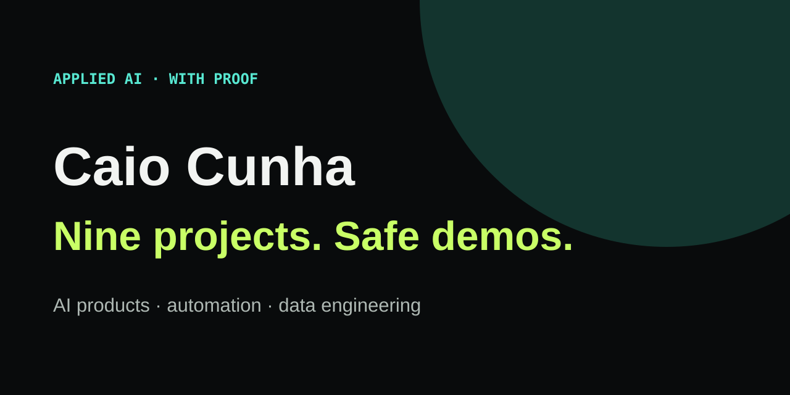

# Caio Cunha — public portfolio

A curated portfolio that puts nine selected products and engineering projects within two clicks of a safe demo, case study, or reproducible run.

[Try the portfolio](https://caio-felice-cunha.github.io/CaioFeliceCunha.github.io/) · [Engineering structure](#showcase-structure) · [View source](https://github.com/Caio-Felice-Cunha/CaioFeliceCunha.github.io) · [Run locally](#run-locally)

## Showcase structure

- **AI Products:** Redax Juris, Voxpage, DrumAI
- **Live Products:** MorarFora, Scoopy
- **Browser Automation:** LinkedIn/X Scheduler, Instagram Reels Poster, YouTube Shorts Scheduler
- **Data Engineering:** Supply Chain Intelligence Hub

Each card uses one of four public states: `Live product`, `Interactive demo`, `Replay demo`, or `Local runnable`. Redax Juris and Voxpage remain visibly gated until historical credentials are rotated; their private repositories are not published.

The seven released cards expose separate **Try the demo**, **Engineering case**,
and **View source** paths. The technical pages cover problem framing,
architecture, workflow, decisions, real public code or clearly labelled private
pseudocode, tests, security boundaries, limitations, and local execution.

## Run locally

~~~bash
npm install
npm test
npm run serve
~~~

Open `http://localhost:4190`.

## Safety and truthfulness

The portfolio is curated in source instead of populated from GitHub's repository API. This prevents old training repositories from displacing selected work and keeps every description reviewable. It includes no customer artifacts, private source, credentials, or unverified performance metrics.

## License

Site code is MIT licensed. Portrait, branding, screenshots, and authored copy remain © 2026 Caio Di Felice Cunha.

